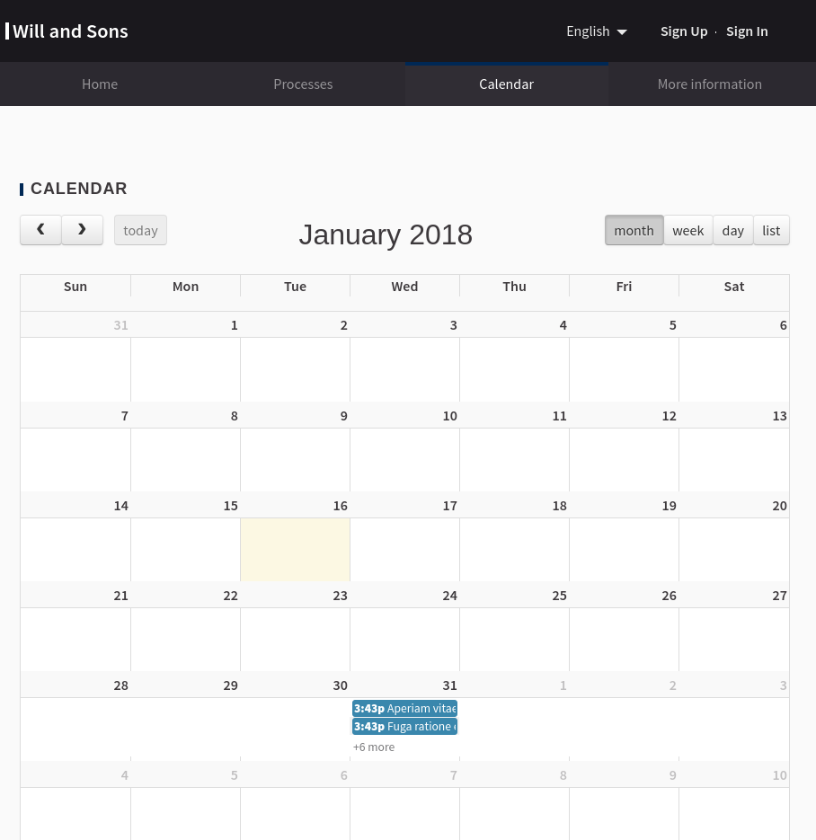

# Decidim::Calendar

Adds a calendar view for all the Meetings, without regarding the Participatory Process or Assembly that they belong. Gives the option of filtering by month, week, day or a list.

]

## Usage

There isn't any configuration for this module.

## Installation
Add this line to your application's Gemfile:

```ruby
gem 'decidim-calendar'
```

And then execute:
```bash
$ bundle
```

## Contributing
Contribution directions go here.
